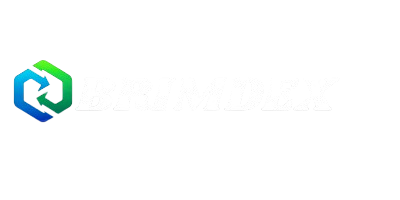

# Brand Assets

This page covers the official **Brimdex brand asset pack** only.

It is not a list of market assets, stock logos, or crypto icons. It is the reference for Brimdex's own visual identity.

## Included logo assets

You can use these files directly from the docs:

- [Full Logo](assets/brand/FULL_LOGO.png)
- [Full Logo White](assets/brand/FULL_LOGO_WHITE.png)
- [Logo Black Background](assets/brand/LOGO_BLACK_BACKGROUND.png)
- [Logo No Background](assets/brand/LOGO_NO_BACKGROUND.png)

## Preview

### Full logo

### White full logo

### Icon on black background

### Icon without background

## Core colors

| Role | Color |
|---|---|
| Brimdex cyan | `#5ec4de` |
| Gradient start | `#3533cd` |
| Gradient end | `#000000` |

## Typography

| Use | Typeface |
|---|---|
| Branding / display | `Times New Roman MT` |
| Alternative display | `Shrikhand` |
| Body copy | `Lato` |

## Usage rules

- keep Brimdex cyan dominant in the brand system
- do not stretch, distort, or recolor the logo
- preserve clear space around the lockup
- keep strong contrast on dark backgrounds

## Asset pack contents

The Brimdex asset pack is expected to include:

- logo variants
- icon-only marks
- color references
- font references
- social templates
- illustrations and iconography

If you publish anything external, use the current Brimdex asset pack instead of rebuilding the brand system from scratch.
